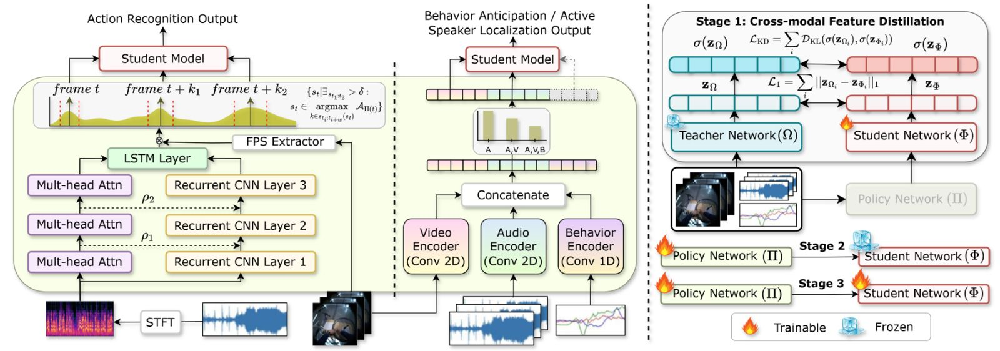

# EgoAdapt: Adaptive Multisensory Distillation and Policy Learning for Efficient Egocentric Perception - <span style="color: red;"> ICCV 2025 </span> 🎉🎉

[📄 Paper](https://arxiv.org/pdf/2506.21080) · [🌐 Project Page](https://schowdhury671.github.io/egoadapt_project/)

<p align="center">
  
</p>


### EgoAdapt Multistage Distillation

- **Action Recognition (AR)** → `policy_pi_ar.py` + **TIM** teacher
- **Behavior Anticipation (BA)** & **Active Speaker Localization (ASL)** → `policy_pi_avloc_ba.py` + **SWL**-style teacher

---


```
egoadapt/
├─ models/
│ ├─ encoders.py # Tiny vision/audio/behavior encoders 
│ ├─ fusion.py # Late fusion head + student container (phi)
│ ├─ policy_pi_ar.py # Policy network for Action Recognition
│ ├─ policy_pi_avloc_ba.py # Policy network for ASL + BA
│ └─ teachers/
│ ├─ tim_teacher.py # Wrapper around TIM (official repo) for AR teacher
│ └─ swl_teacher_lite.py # SWL-style teacher for BA/ASL (lite reimpl.)
├─ losses/
│ ├─ distillation.py # KD, CE, feature alignment; policy efficiency costs
│ └─ __init__.py
├─ train/
│ ├─ stage1_cfd.py # Train phi only (teacher-student distillation)
│ ├─ stage2_policy_ar.py # Train pi (AR)
│ ├─ stage2_policy_avloc_ba.py # Train pi (ASL/BA)
│ └─ stage3_joint.py # Joint finetuning (eta1 * L_pi + eta2 * L_phi)
├─ data/
│ └─ datasets.py # Minimal dataset adapters & collators (EPIC/AEA/EasyCom stubs)
├─ utils/
│ ├─ schedulers.py # temperature anneal, misc. helpers
│ ├─ optim.py # optimizers
│ └─ ckpt.py # checkpoint save/load
├─ README.md
└─ setup.py
```


## 1. Install 🛠️


```bash
git clone <this_repo> egoadapt && cd egoadapt
python -m venv .venv && source .venv/bin/activate
pip install -U pip wheel setuptools
pip install torch torchvision torchaudio # choose CUDA version as needed
pip install -e .


# Add TIM as a submodule and install it editable
git submodule add https://github.com/JacobChalk/TIM external/TIM
pip install -e external/TIM

```


> **TIM features:** TIM trains/evaluates from **pre-extracted features**.  
> Follow `external/TIM/feature_extractors/` to extract video/audio features and obtain the ground-truth files.  
> Keep those features handy; the teacher wrapper expects them.


## 2. Quickstart: Stage‑1 Cross‑Modal Feature Distillation 🔥

### Action Recognition (AR) with TIM teacher

```
from egoadapt.models.fusion import CrossModalStudentPhi
from egoadapt.models.teachers.tim_teacher import TIMTeacher
from egoadapt.losses.distillation import CFDLossWeights
from egoadapt.train.stage1_cfd import train_step


phi = CrossModalStudentPhi(n_classes=97, d=256)
teacher = TIMTeacher(cfg={"num_classes":97}, ckpt_path="/path/to/tim_ckpt.pth", device="cuda")


batch = next(iter(loader)) # your EPIC dataloader producing {I,A,B,y,teacher_inputs}
opt = torch.optim.AdamW(phi.parameters(), lr=2e-4)
losses = train_step(phi, teacher, batch, CFDLossWeights(), opt)
print(losses)

```

### BA/ASL with SWLTeacherLite
```
from egoadapt.models.fusion import CrossModalStudentPhi
from egoadapt.models.teachers.swl_teacher_lite import SWLTeacherLite
from egoadapt.losses.distillation import CFDLossWeights
from egoadapt.train.stage1_cfd import train_step


phi = CrossModalStudentPhi(n_classes=20, d=256)
teacher = SWLTeacherLite(d=256, n_classes_asl=2, n_classes_ba=20)
# prepare teacher_inputs in your batch to call: teacher(v_tokens, a_tokens, b_dirs)["ba_logits"] or ["asl_logits"]
```


> During Stage‑1, we minimize L_phi = alpha * L_KD + (1-alpha) * CE + beta * L1 between the phi student logits and the teacher logits.


## 3. Stage‑2 Policy Learning (pi) 🔥

### AR (policy_pi_ar.py):

```
from egoadapt.models.policy_pi_ar import PolicyNetAR
from egoadapt.train.stage2_policy_ar import train_step_policy_ar


pi_ar = PolicyNetAR(d_feat=256, n_modalities=3, audio_channels=1)
logs = train_step_policy_ar(phi, pi_ar, batch_seq, lambdas=[0.3,0.3,0.3], gamma_miscls=1.0, tau=1.0, opt=opt)
```

### ASL/BA (policy_pi_avloc_ba.py):

```
from egoadapt.models.policy_pi_avloc_ba import PolicyNetASL_BA
from egoadapt.train.stage2_policy_avloc_ba import train_step_policy_avloc_ba


pi_ab = PolicyNetASL_BA(d_feat=256, n_modalities=3, audio_channels=1)
logs = train_step_policy_avloc_ba(phi, pi_ab, batch_seq, lambdas=[0.3,0.3,0.3], task="asl", opt=opt)
```


> Policy loss: L_pi = gamma * CE + \sum_k lambda_k * (frac_kept_k)^2 (efficiency‑accuracy tradeoff).
> Anneal Gumbel-Softmax temperature tau with utils/schedulers.py.


## 4. Stage‑3 Joint Finetuning 🔥

```
from egoadapt.train.stage3_joint import train_step_joint
from egoadapt.losses.distillation import CFDLossWeights


logs = train_step_joint(
model_phi=phi,
model_pi=pi_ar,
batch_seq=batch_seq,
teacher_logits_seq=teacher_logits_seq, # shape [B,T,C]
cfd_w=CFDLossWeights(alpha=0.5,beta=0.1,T=2.0),
lambdas=[0.3,0.3,0.3],
gamma_miscls=1.0,
tau=0.8,
eta1=1.0,
eta2=1.0,
opt=opt_joint,
)
```


## 5. Data Preparation 🗂️

- EPIC‑KITCHENS (AR): follow TIM’s feature_extractors/ and recognition/ instructions to get video/audio features and ground truth.
- EasyCom (ASL): build (I_seq, A_seq, B_seq) windows with head/gaze as unit vectors for B_seq.
- AEA (BA): similar multi‑modal windows, aligning labels to the final step.


## 6. Inference 💊

```
phi.eval()
with torch.no_grad():
out = phi(I, A, B) # returns {z_phi, logits}
pred = out["logits"].argmax(-1)

# Build z_phi per step then apply pi to keep/drop and aggregate logits.
```


## 7. Citations :pray:

- TIM code and models: see external/TIM license.
- SWL (ECCV’24) paper for the world‑locking idea; the included SWLTeacherLite is an original implementation inspired by the paper.

```
@inproceedings{Chalk2024TIM,
title={{TIM}: A Time Interval Machine for Audio-Visual Action Recognition},
booktitle={CVPR}, year={2024}
}


@inproceedings{Yun2024SWL,
title={Spherical World-Locking for Audio-Visual Localization in Egocentric Videos},
booktitle={ECCV}, year={2024}
}
```
  

- If you find our work useful, please consider citing: :mortar_board:
```
@article{chowdhury2025egoadapt,
  title={EgoAdapt: Adaptive Multisensory Distillation and Policy Learning for Efficient Egocentric Perception},
  author={Chowdhury, Sanjoy and Biswas, Subrata and Nag, Sayan and Nagarajan, Tushar and Murdock, Calvin and Ananthabhotla, Ishwarya and Qian, Yijun and Ithapu, Vamsi Krishna and Manocha, Dinesh and Gao, Ruohan},
  journal={arXiv preprint arXiv:2506.21080},
  year={2025}
}
```


